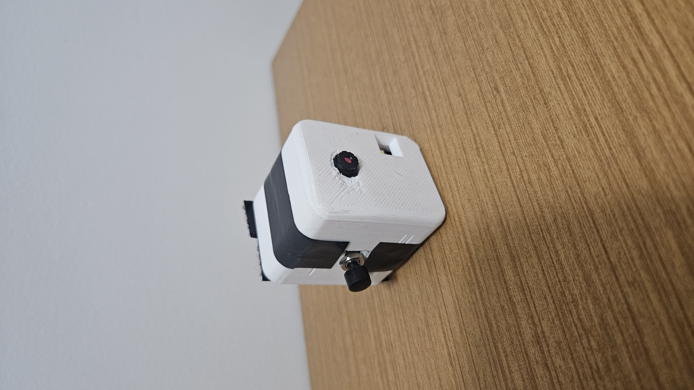

## Funcionalidade

O ESP32-CAM é alimentado por um power bank conectado via adaptador USB-C para Micro USB. Um botão físico está conectado a um dos pinos GPIO do ESP32-CAM e pode ser utilizado para enviar a imagem para análise.

## Componentes
- ESP32-CAM
- Case 3D
- Botão tipo push
- Powerbank ou equivalente para alimentação
- Velcro para fixação
- Colete ou equivalente para fixação no corpo

## Montagem

1. Imprima o case em 3D (arquivo `case.stl`).
2. Solde o botão ao pino GPIO desejado no ESP32-CAM (Configurável no software)
3. Coloque o ESP32-CAM e os demais componentes no case.
4. Conecte o power bank ao ESP32-CAM
5. Abra um espaço no case para inserir o botão.

## Considerações

- Certifique-se de que o botão esteja corretamente soldado e isolado para evitar curto-circuitos.
- A escolha do GPIO deve ser compatível com o firmware em uso no ESP32-CAM.

## Licença

Este projeto é de uso livre para fins educacionais e pessoais. Para usos comerciais, entre em contato.

